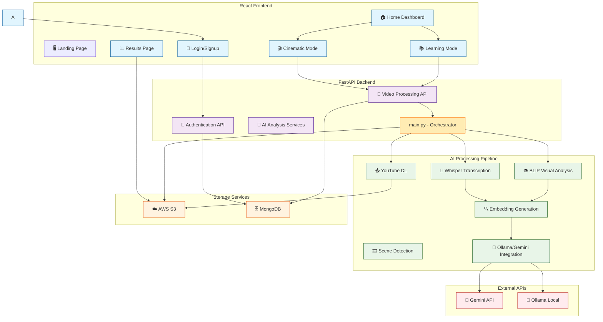
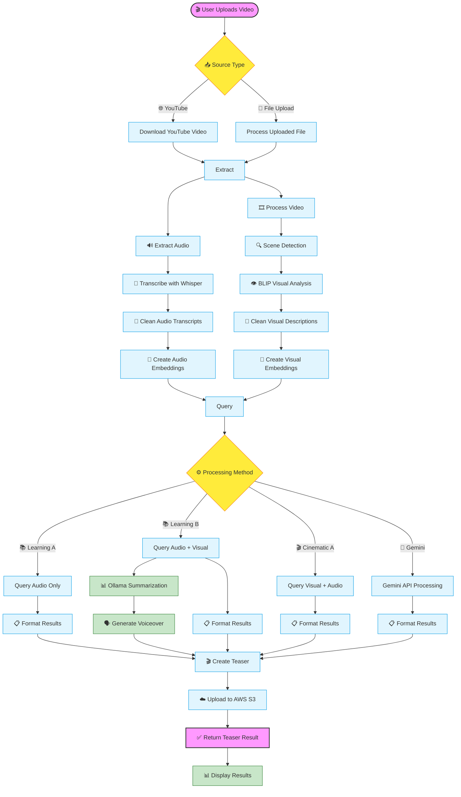

# AI Teaser Generator - Complete Documentation

## Overview
AI Teaser Generator is a full-stack web application that uses AI-driven analysis to create cinematic or educational teasers from raw video content. The platform combines multiple AI technologies including Whisper transcription, BLIP visual analysis, sentence embeddings, and generative AI (Ollama/Gemini) to automatically identify and compile the most compelling moments from videos.

## Architecture Diagram



## Complete Processing Flow



## Features

1. **🔐 User Authentication**: Secure login/signup with session management
2. **📥 Multiple Input Sources**: Support for YouTube URLs and direct video uploads
3. **🎯 Dual Processing Modes**: 
   - 🎬 Cinematic Mode: Focus on visual storytelling
   - 📚 Learning Mode: Emphasis on educational content
4. **🤖 AI-Powered Analysis**: 
   - 🎤 Whisper for audio transcription
   - 👁️ BLIP for visual description
   - 🔍 Scene detection for key moment identification
5. **⚡ Smart Teaser Generation**: 
   - 🔍 Semantic search for relevant content
   - ⚙️ Multiple processing methods
   - ⏱️ Dynamic duration adjustment
6. **☁️ Cloud Storage**: AWS S3 integration for file storage
7. **📊 History Tracking**: MongoDB storage of user generation history
8. **📱 Responsive Design**: Modern UI with Tailwind CSS

## Tech Stack

### Frontend
- **⚛️ React.js** with Vite for fast development
- **🎨 Tailwind CSS** for styling
- **🎯 Lucide React** for icons
- **📡 Axios** for API communication

### Backend
- **🚀 FastAPI** for high-performance API development
- **🐍 Python** for backend logic
- **🎥 FFmpeg** for video processing

### AI & Processing
- **🎤 Whisper** for audio transcription
- **👁️ BLIP** for visual analysis
- **🔢 Sentence Transformers** for embeddings
- **📊 FAISS** for similarity search
- **🦙 Ollama** for local LLM processing
- **🚀 Google Gemini API** for AI analysis
- **🗣️ pyttsx3** for text-to-speech

### Storage & Infrastructure
- **🗄️ MongoDB** for database
- **☁️ AWS S3** for file storage
- **🔐 bcrypt** for password hashing

## Project Structure

```
ai-teaser-generator/
├── frontend/                 # React Vite application
│   ├── src/
│   │   ├── pages/           # React page components
│   │   ├── components/      # Reusable components
│   │   ├── App.jsx         # Main application component
│   │   └── main.jsx        # Application entry point
│   ├── package.json
│   └── vite.config.js
│
├── backend/                  # FastAPI application
│   ├── main_fastapi.py      # Main FastAPI application
│   ├── main.py              # Main processing orchestrator
│   ├── config.py            # Configuration settings
│   ├── db.py                # Database connection
│   ├── db_helper.py         # Database operations
│   ├── get_videos_from_url.py       # Video download handling
│   ├── transcribe_audio_from_whisper.py    # Audio transcription
│   ├── get_description_from_blip.py        # Visual analysis
│   ├── clean_audio_transcripts.py          # Transcript cleaning
│   ├── clean_visual_descriptions.py        # Visual description cleaning
│   ├── create_embeddings_and_query.py      # Embedding processing
│   ├── ollama_summarization_voiceover.py   # Ollama integration
│   ├── get_timestamps_from_gemini.py       # Gemini API integration
│   ├── get_timestamps_from_embeds_output.py # Timestamp extraction
│   ├── making_teaser_from_timestamps.py    # Teaser generation
│   ├── requirements.txt
│   └── .env                 # Environment variables
│
└── README.md
```

## Workflow & File Dependencies

1. **📥 User Uploads Video** → `main.py` (orchestrator) → `get_videos_from_url.py`
2. **🔊 Extract Audio** → `main.py` → `transcribe_audio_from_whisper.py`
3. **📝 Transcribe Audio** → `main.py` → `clean_audio_transcripts.py`
4. **👁️ Analyze Video** → `main.py` → `get_description_from_blip.py` → `clean_visual_descriptions.py`
5. **🔢 Create Embeddings** → `main.py` → `create_embeddings_and_query.py`
6. **⚙️ Process Based on Method** → 
   - Learning A/B: `main.py` → `create_embeddings_and_query.py` → `get_timestamps_from_embeds_output.py`
   - Cinematic A: `main.py` → `create_embeddings_and_query.py` → `get_timestamps_from_embeds_output.py`
   - Gemini: `main.py` → `get_timestamps_from_gemini.py`
7. **🎬 Generate Teaser** → `main.py` → `making_teaser_from_timestamps.py`
8. **📊 Special Processing for Learning B** → `main.py` → `ollama_summarization_voiceover.py`
9. **💾 Store Results** → `main.py` → `db_helper.py` → AWS S3

## Main.py - The Orchestrator

The `main.py` file serves as the central orchestrator for the entire teaser generation process. It coordinates all the different components and handles the workflow based on the selected method.

### Key Functions in main.py:

1. **`process_video_to_teaser()`**: Main function that orchestrates the entire teaser generation process
2. **Method Handling**: 
   - Special handling for Gemini method (direct API call)
   - Standard processing for Learning A, Learning B, and Cinematic A methods
3. **Workflow Coordination**: Manages the sequence of processing steps
4. **Error Handling**: Provides comprehensive error handling throughout the process
5. **Result Aggregation**: Collects and returns all relevant data about the generated teaser

### Processing Steps in main.py:

1. **Input Processing**: Handles both YouTube URLs and uploaded files
2. **Audio Processing**: Transcribes and cleans audio content
3. **Visual Processing**: Analyzes and describes visual content
4. **Embedding Generation**: Creates semantic embeddings for content
5. **Method-Specific Processing**: 
   - Learning A: Audio-focused processing
   - Learning B: Audio + Visual with summarization
   - Cinematic A: Visual-focused processing
   - Gemini: Direct API integration
6. **Teaser Generation**: Compiles the final teaser video
7. **Upload & Storage**: Saves results to S3 and updates database

## Methods Definition

1. **📚 Learning Method A**: Focuses on audio content for educational teasers
   - Uses audio embeddings only
   - Selects most relevant dialogue segments

2. **📚 Learning Method B**: Combines audio summarization with visual highlights
   - Uses both audio and visual embeddings
   - Generates summary with Ollama
   - Creates voiceover with pyttsx3

3. **🎬 Cinematic Method A**: Emphasizes visual content with supporting audio
   - Uses visual embeddings primarily
   - Selects most visually compelling moments
   - Includes supporting audio context

4. **🚀 Gemini Method**: Uses Google's Gemini API for intelligent timestamp selection
   - Uploads video to Gemini API
   - Uses AI to identify key moments
   - Returns precise timestamps for teaser

## Input/Output Formats

### Input:
- Video file (MP4, MOV, etc.) or YouTube URL
- Processing method selection
- Minimum and maximum duration parameters

### Output:
- Processed teaser video on AWS S3
- JSON response with:
  - S3 URL of generated teaser
  - Original video S3 URL
  - Audio S3 URL
  - Duration of teaser
  - Timestamps used
  - Optional summary text

## Environment Variables

### Backend (.env)
```env
# AWS Configuration
AWS_ACCESS_KEY=your_aws_access_key
AWS_SECRET_KEY=your_aws_secret_key
AWS_REGION=your_aws_region
BUCKET_NAME=your_s3_bucket_name

# MongoDB Configuration
MONGO_URI=your_mongodb_connection_string

# Model Configuration
WHISPER_MODEL=small
BLIP_MODEL=Salesforce/blip-image-captioning-large
SENTENCE_TRANSFORMER_MODEL=all-MiniLM-L6-v2

# FFmpeg Configuration
FFMPEG_PATH=C:/path/to/ffmpeg/bin

# API Keys
GEMINI_API_KEY=your_gemini_api_key
```

### Frontend (.env)
```env
VITE_API_BASE_URL=http://localhost:8000
VITE_APP_NAME=AI Teaser Generator
```

## Installation & Setup

### Prerequisites
- 🐍 Python 3.8+
- ⚛️ Node.js 14+
- 🗄️ MongoDB
- 🎥 FFmpeg
- ☁️ AWS Account with S3 bucket
- 🦙 Ollama (for local LLM processing)
- 🌐 Google Cloud Account (for Gemini API)

### Backend Setup
```bash
# Navigate to backend directory
cd backend

# Create virtual environment
python -m venv venv

# Activate virtual environment
# On Windows:
venv\Scripts\activate
# On macOS/Linux:
source venv/bin/activate

# Install dependencies using UV (fast Python package installer)
pip install uv
uv pip install -r requirements.txt

# Alternative: Install dependencies with pip
pip install -r requirements.txt

# Set environment variables
cp .env.example .env
# Edit .env with your configuration

# Install Ollama (for local LLM processing)
# Follow instructions at: https://ollama.ai/

# Start the server with Uvicorn
uvicorn main_fastapi:app --reload --host 0.0.0.0 --port 8000
```

### Frontend Setup
```bash
# Navigate to frontend directory
cd frontend

# Install dependencies
npm install

# Start development server
npm run dev
```

## About UV Package Manager

UV is a fast Python package installer and resolver written in Rust, designed to be a drop-in replacement for pip and pip-tools. It's significantly faster than traditional pip and provides better dependency resolution.

### Key Features of UV:
- ⚡ **Blazing fast** - up to 10-100x faster than pip
- 🔒 **Reliable dependency resolution**
- 📦 **pip-compatible** command interface
- ♻️ **Efficient caching** and reuse of packages
- 🏗️ **Built-in virtual environment management**

### Using UV for Dependency Management:

**requirements.txt** (Backend Dependencies):
```txt
fastapi==0.104.1
uvicorn[standard]==0.24.0
python-multipart==0.0.6
bcrypt==4.0.1
pymongo==4.6.0
yt-dlp==2023.11.16
torch==2.1.1
whisper-timestamped==1.14.2
transformers==4.36.2
opencv-python==4.8.1.78
scenedetect==0.6.2
boto3==1.34.17
python-dotenv==1.0.0
sentence-transformers==2.2.2
faiss-cpu==1.7.4
google-generativeai==0.3.2
pyttsx3==2.90
```

**Installation with UV:**
```bash
# Install UV
pip install uv

# Install dependencies from requirements.txt
uv pip install -r requirements.txt

# Or install packages directly
uv pip install fastapi uvicorn python-multipart
```

## Usage

1. **🌐 Access Application**: Open http://localhost:5173 in your browser
2. **👤 Create Account**: Sign up for a new account or login
3. **🎯 Select Mode**: Choose between Cinematic or Learning mode
4. **📥 Upload Video**: Provide either a YouTube URL or upload a video file
5. **⚙️ Configure Parameters**: Set minimum and maximum duration, select processing method
6. **🚀 Generate Teaser**: Click generate and wait for processing
7. **📥 Download Result**: Preview and download the generated teaser

## Contributing
1. 📋 Fork the repository
2. 🌿 Create your feature branch (`git checkout -b feature/AmazingFeature`)
3. 💾 Commit your changes (`git commit -m 'Add some AmazingFeature'`)
4. 📤 Push to the branch (`git push origin feature/AmazingFeature`)
5. 🔀 Open a Pull Request

## License
This project is licensed under the MIT License.
