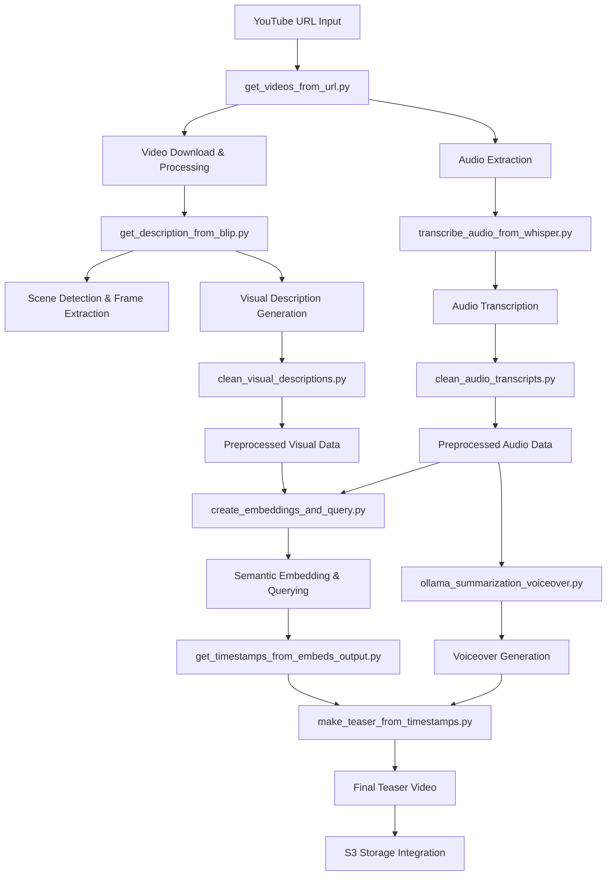

# YouTube Teaser Generator 🎬

A sophisticated AI-powered pipeline that automatically generates teaser videos from YouTube content using multimodal analysis (audio transcription + visual description) and semantic embedding techniques.

## 🌟 Features

- **YouTube Video Processing**: Downloads and processes YouTube videos with optimized audio extraction
- **Multimodal Analysis**: 
  - Whisper timestamped audio transcription
  - BLIP visual scene description generation
- **Semantic Embedding**: FAISS-based retrieval of most relevant video segments
- **Multiple Generation Methods**: Three distinct teaser generation approaches
- **AWS Integration**: Seamless S3 storage integration for processed assets

## 🏗️ Architecture Diagram



## 📋 Workflow & File Dependencies

### Core Processing Pipeline

1. **Input Acquisition** (`get_videos_from_url.py`)
   - **Input**: YouTube URL string
   - **Output**: 
     - Local video file path (MP4)
     - Processed audio file path (WAV)
   - **Calls**: None (entry point)

2. **Audio Processing** (`transcribe_audio_from_whisper.py`)
   - **Input**: Audio file path from step 1
   - **Output**: Raw audio transcript segments with timestamps
   - **Calls**: None (standalone processing)

3. **Visual Processing** (`get_description_from_blip.py`)
   - **Input**: Video file path from step 1
   - **Output**: Raw visual description segments with timestamps
   - **Calls**: None (standalone processing)

4. **Data Cleaning** (`clean_audio_transcripts.py`, `clean_visual_descriptions.py`)
   - **Input**: Raw segments from steps 2 and 3
   - **Output**: Preprocessed segments (filler removal, deduplication)
   - **Calls**: None (data transformation)

5. **Semantic Processing** (`create_embeddings_and_query.py`)
   - **Input**: Preprocessed audio and visual data
   - **Output**: 
     - FAISS indices for both modalities
     - Query results for best segments
   - **Calls**: None (embedding generation)

6. **Timestamp Extraction** (`get_timestamps_from_embeds_output.py`)
   - **Input**: Query results from step 5
   - **Output**: Timestamp pairs for video clipping
   - **Calls**: None (timestamp processing)

7. **Voiceover Generation** (`ollama_summarization_voiceover.py`) - *Method B only*
   - **Input**: Preprocessed audio data from step 4
   - **Output**: Timed summary audio file (MP3)
   - **Calls**: None (audio generation)

8. **Teaser Assembly** (`make_teaser_from_timestamps.py`)
   - **Input**: 
     - Original video from step 1
     - Timestamps from step 6
     - (Optional) Voiceover from step 7
   - **Output**: Final teaser video file (MP4)
   - **Calls**: None (video processing)

## 🔧 Methods Definition

### Learning Method A
- **Purpose**: Audio-focused teaser using only the best audio segments
- **Process**: 
  1. Uses only audio embeddings to select segments
  2. No voiceover generated
  3. Original audio from video clips is preserved
- **Output**: Video with selected audio segments

### Learning Method B
- **Purpose**: Balanced approach using both audio and visual elements
- **Process**:
  1. Uses both audio and visual embeddings
  2. Generates summarized voiceover from audio content
  3. Selects visual segments based on semantic relevance
  4. Combines selected visuals with generated voiceover
- **Output**: Video with selected visuals and generated voiceover

### Cinematic Method A
- **Purpose**: Visual-focused teaser emphasizing cinematic moments
- **Process**:
  1. Uses both audio and visual embeddings
  2. Focuses on visually striking segments
  3. Preserves original audio from selected segments
  4. No voiceover generated
- **Output**: Video with selected visual segments and their original audio

## 📊 Input/Output Formats

### Audio Data Format
```python
# Input/Output structure for audio processing
[
    {
        "timestamp": "[start_time]s - [end_time]s",
        "text": "transcribed text content"
    }
]
```

### Visual Data Format
```python
# Input/Output structure for visual processing
[
    {
        "timestamp": "[timestamp]s",
        "text": "visual description content"
    }
]
```

### Embedding Query Results
```python
# Output from create_embeddings_and_query.py
{
    "audio_results": [
        {
            "timestamp": "[start_time]s - [end_time]s",
            "text": "selected audio text",
            "score": similarity_score
        }
    ],
    "visual_results": [
        {
            "timestamp": "[timestamp]s",
            "text": "selected visual description",
            "score": similarity_score
        }
    ]
}
```

## 🚀 Quick Start

### Prerequisites
```bash
# Install dependencies
pip install boto3 python-dotenv yt-dlp torch whisper-timestamped transformers opencv-python scenedetect sentence-transformers faiss-cpu ollama pyttsx3

# Install FFmpeg (required for audio/video processing)
# Ubuntu/Debian
sudo apt install ffmpeg

# Windows (via chocolatey)
choco install ffmpeg

# macOS
brew install ffmpeg
```

### Configuration
1. Clone this repository
2. Install required dependencies
3. Set up environment variables in `.env`:
```env
AWS_ACCESS_KEY=your_access_key
AWS_SECRET_KEY=your_secret_key
AWS_REGION=us-east-1
BUCKET_NAME=your_bucket_name
```

### Usage
```python
# Run the complete pipeline
from main_workflow import youtube_to_teaser

result = youtube_to_teaser(
    youtube_url="https://youtu.be/EXAMPLE_VIDEO",
    method="learning_b",  # Choose from: learning_a, learning_b, cinematic_a
    output_dir="output"
)

print(f"Teaser generated: {result['s3_url']}")
```

## 📁 Project Structure
```
youtube-teaser-generator/
│
├── get_videos_from_url.py          # Video download & initial processing
├── transcribe_audio_from_whisper.py # Audio transcription
├── get_description_from_blip.py     # Visual description generation
├── clean_audio_transcripts.py       # Audio data preprocessing
├── clean_visual_descriptions.py     # Visual data preprocessing
├── create_embeddings_and_query.py   # Semantic embedding & querying
├── get_timestamps_from_embeds_output.py # Timestamp extraction
├── ollama_summarization_voiceover.py # Voiceover generation (Method B)
├── make_teaser_from_timestamps.py   # Final video assembly
├── main_workflow.py                # Integrated workflow
└── README.md                       # This file
```

## 💡 Advanced Configuration

### Customizing Query Parameters
In `create_embeddings_and_query.py`, you can modify the query texts for each method:

```python
# Customize these queries for your specific needs
QUERY_CONFIG = {
    "learning_a": {
        "audio_query": "most engaging and informative dialogue",
        "visual_query": ""
    },
    "learning_b": {
        "audio_query": "key points and summary",
        "visual_query": "most relevant and descriptive visuals"
    },
    "cinematic_a": {
        "audio_query": "cinematic and dramatic audio",
        "visual_query": "most cinematic and visually appealing scenes"
    }
}
```

### Adjusting Video Processing Parameters
In `make_teaser_from_timestamps.py`, you can modify video processing settings:

```python
# FFmpeg quality parameters
FFMPEG_CONFIG = {
    "video_codec": "libx264",
    "preset": "fast",
    "crf": "18",
    "audio_codec": "aac"
}
```

## 🛠️ Troubleshooting

### Common Issues

1. **FFmpeg not found**
   - Ensure FFmpeg is installed and available in PATH
   - Or set the `FFMPEG_PATH` environment variable

2. **Whisper model download issues**
   - Check internet connection
   - Verify sufficient disk space for models

3. **AWS credentials errors**
   - Verify AWS credentials in `.env` file
   - Check S3 bucket permissions

4. **Ollama connection issues**
   - Ensure Ollama is running locally
   - Verify model availability (`llama3.2:latest`)

## 📄 License

This project is licensed under the MIT License - see the LICENSE file for details.

## 🙋‍♂️ Support

For support or questions, please open an issue in the GitHub repository or contact the development team.

---

**Note**: This project requires significant computational resources for optimal performance, especially for video processing and ML inference tasks . For production deployment, consider using GPU-optimized instances and distributed processing architectures .
